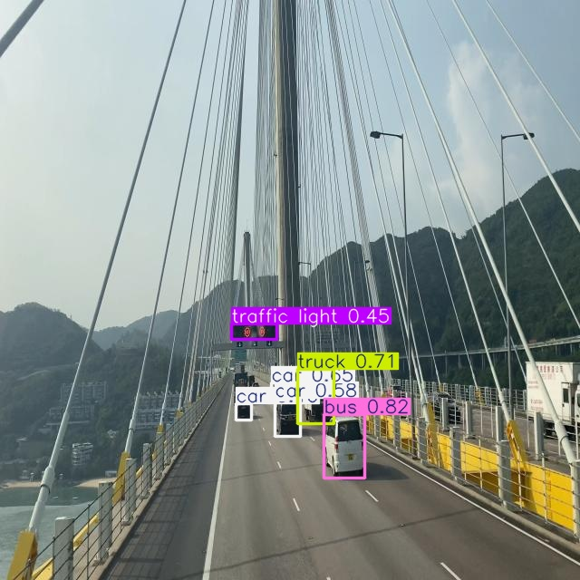
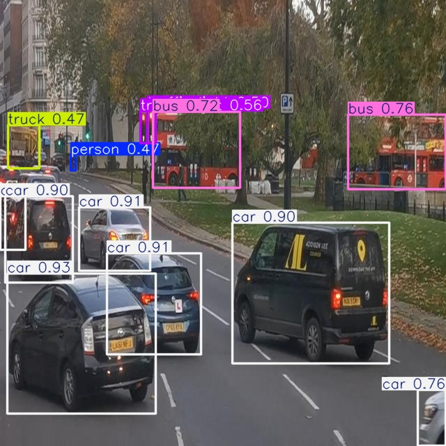
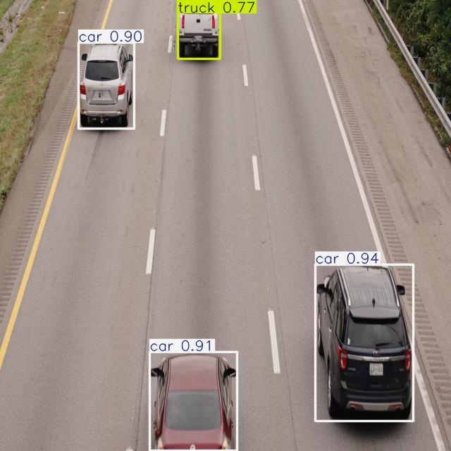
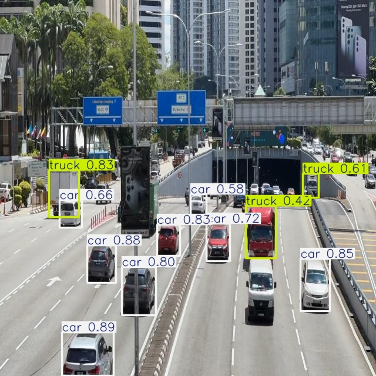
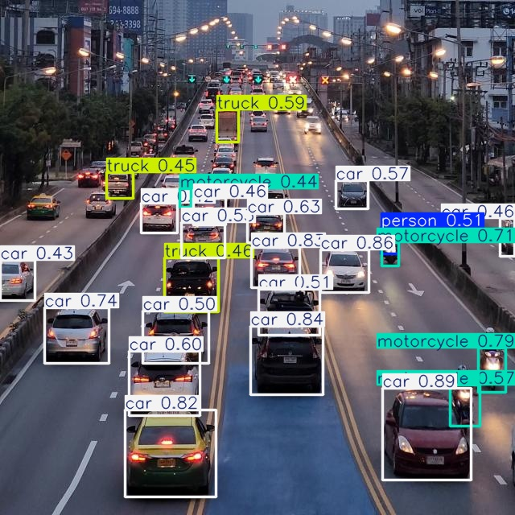
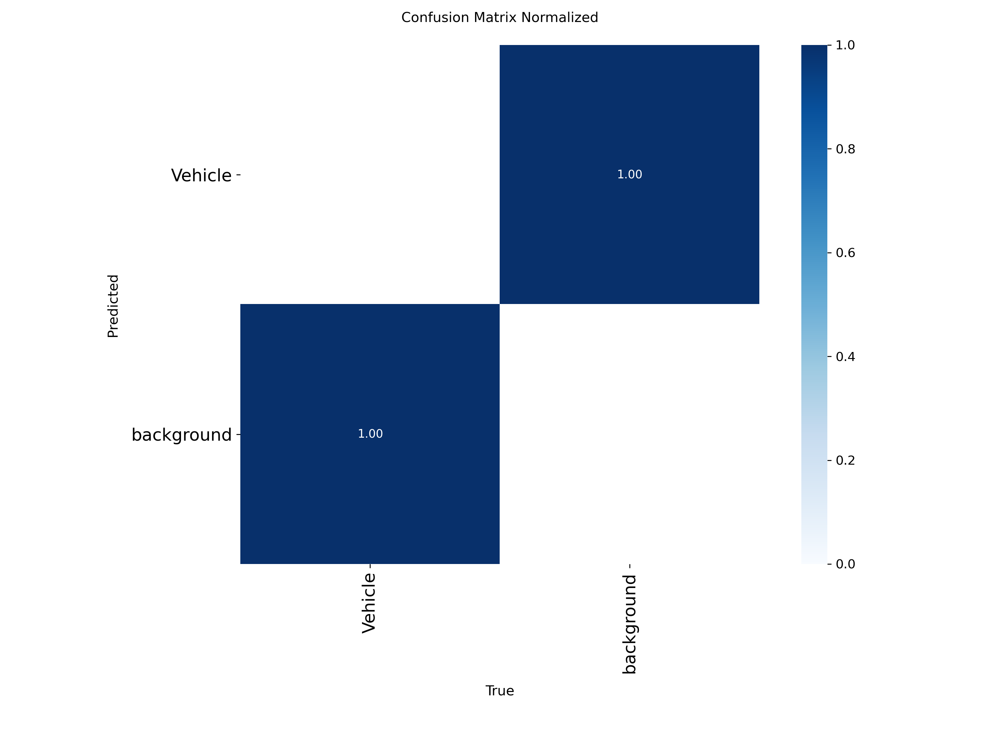
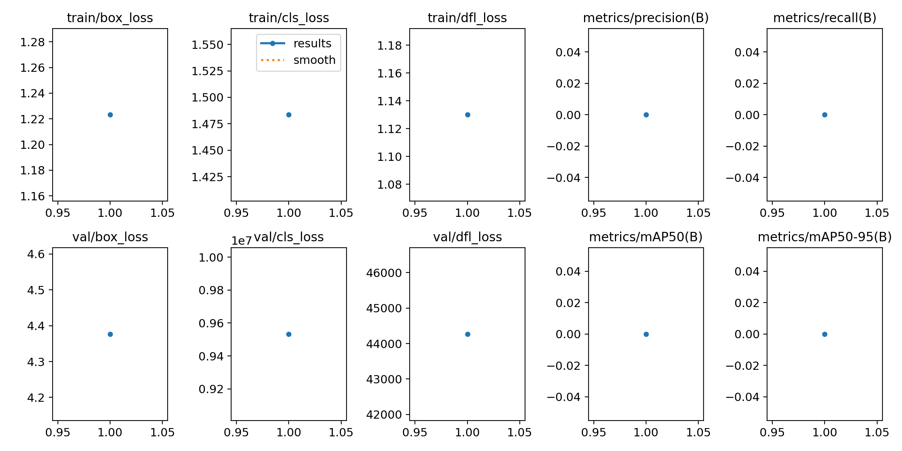

# Traffic Management System Using YOLO (v8–v11)

This project implements a **Traffic Management System** using YOLO object detection models (v8–v11)
It is designed to **monitor traffic flow**, count vehicles, detect congestion, and identify potential traffic jams in real-time. 
The system works on **Google Colab** and can analyze video footage for autonomous traffic monitoring applications.

---

## 🔹 Key Features
- **Vehicle Counting**: Detects cars, trucks, motorcycles, and other vehicles in real-time 
- **Traffic Flow Analysis**: Measures traffic smoothness or congestion.  
- **Traffic Jam Detection**: Flags areas where vehicles remain stationary for a prolonged time (e.g., 10 vehicles in one zone)
- **Real-Time Monitoring**: Works on video streams with annotated frames.  
- **YOLO Models**: Tested with YOLOv8 to YOLOv11 for accuracy and performance.

---

### Traffic Flow Monitoring
  
*Traffic Detection Sample 1*

  
*Traffic Detection Sample 2*

## 🚗 Vehicle Detection.

Here are some sample detected frames from the model:

  
  
  
  

---

## 📊 Results / Evaluation

Here are the evaluation results and metrics from the Traffic Management System:

### Confusion Matrices
.png)  
  

### Performance Graph

---

## 🛠 Tech Stack
- **Python**  
- **YOLOv8 – YOLOv11** (Ultralytics)  
- **OpenCV**  
- **Google Colab / Kaggle**  
- **PyTorch**

---

## 🚀 How It Works.
1. **Video Input:** Feed traffic footage into the model.  
2. **Object Detection:** YOLO detects vehicles and pedestrians.  
3. **Vehicle Counting:** Count moving and stationary vehicles in each zone.  
4. **Traffic Flow Analysis:** Determine smoothness or congestion.  
5. **Traffic Jam Detection:** Flag areas where multiple vehicles stay for a prolonged time.

---

## 📄 Applications
- Smart city traffic monitoring  
- Autonomous vehicle research  
- Traffic safety analysis
